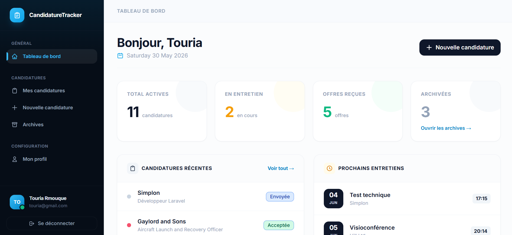

# CandidatureTracker

> Application Laravel 13 de suivi personnalisé de candidatures pour jeunes diplômés.




---

## Présentation

**CandidatureTracker** centralise le suivi des candidatures d'emploi en un seul endroit. Fini les notes dispersées, les oublis de relances et les chevauchements d'entretiens, l'outil transforme une gestion mentale stressante en un processus structuré et efficace.

---

## Fonctionnalités

| US | Fonctionnalité | Statut |
|---|---|---|
| US1 | Inscription / Connexion / Déconnexion (Laravel Breeze) | ✅ |
| US2 | Liste des candidatures actives | ✅ |
| US3 | Créer une candidature | ✅ |
| US4 | Voir le détail d'une candidature | ✅ |
| US5 | Modifier une candidature | ✅ |
| US6 | Archiver une candidature (Soft Delete) | ✅ |
| US7 | Page Archives | ✅ |
| US8 | Restaurer une candidature archivée | ✅ |
| US9 | Filtres par statut et priorité | ✅ |
| US10 | Ajouter un entretien | ✅ |
| US11 | Modifier / Supprimer un entretien | ✅ |
| Bonus | File Storage — pièces jointes (CV, lettre) | ✅ |
| Bonus | Tests Pest — unitaires et fonctionnels | ✅ |

---

## Stack technique

- **Framework** : Laravel 13
- **Langage** : PHP 8.3
- **Authentification** : Laravel Breeze
- **Templates** : Blade
- **Base de données** : MySQL 
- **Tests** : Pest
- **Debug** : Laravel Debugbar
- **CSS** : Tailwind CSS

---

## Installation

### Prérequis

- PHP 8.2+
- Composer
- Node.js 18+ & npm
- MySQL 8+ ou SQLite

### Étapes

```bash
# 1. Cloner le repo
git clone https://github.com/username/candidature-tracker.git
cd candidature-tracker

# 2. Installer les dépendances PHP
composer install

# 3. Installer les dépendances JS
npm install && npm run build

# 4. Configurer l'environnement
cp .env.example .env
php artisan key:generate

# 5. Configurer la base de données dans .env
# Pour SQLite (développement) :
DB_CONNECTION=sqlite

# Pour MySQL :
DB_CONNECTION=mysql
DB_HOST=127.0.0.1
DB_PORT=3307
DB_DATABASE=candidature_tracker
DB_USERNAME=root
DB_PASSWORD=secret

# 6. Exécuter les migrations
php artisan migrate

# 7. (Optionnel) Remplir avec des données de démonstration
php artisan db:seed

# 8. Lancer le serveur
php artisan serve
```

Ouvrez **http://localhost:8000**

**Compte de démonstration :**
```
Email    : demo@candidature-tracker.fr
Password : password
```

---

## Tests

```bash
# Lancer tous les tests
php artisan test

# Avec détail
php artisan test --verbose

# Un seul fichier
php artisan test tests/Feature/CandidatureTest.php
```

Les tests couvrent :
- Accès non autorisé bloqué par la Policy
- Création valide et invalide
- Archivage et restauration
- Filtres par statut
- Upload de fichier

---

## Structure du projet

```
app/
├── Http/
│   ├── Controllers/
│   │   ├── CandidatureController.php
│   │   └── EntretienController.php
│   └── Requests/
│       ├── StoreCandidatureRequest.php
│       ├── UpdateCandidatureRequest.php
│       ├── StoreEntretienRequest.php
│       └── UpdateEntretienRequest.php
├── Models/
│   ├── Candidature.php       # SoftDeletes, relations, accesseurs
│   └── Entretien.php
└── Policies/
    ├── CandidaturePolicy.php
    └── EntretienPolicy.php

database/
├── migrations/
│   ├── create_candidatures_table.php   # softDeletes()
│   └── create_entretiens_table.php
├── factories/
│   ├── CandidatureFactory.php
│   └── EntretienFactory.php
└── seeders/
    └── DatabaseSeeder.php

resources/views/
├── layouts/app.blade.php
├── candidatures/
│   ├── index.blade.php
│   ├── create.blade.php
│   ├── show.blade.php
│   ├── edit.blade.php
│   └── archives.blade.php
└── entretiens/
    ├── create.blade.php
    └── edit.blade.php

routes/
└── web.php

tests/
└── Feature/
    └── CandidatureTest.php   # 17 tests Pest
```

---


